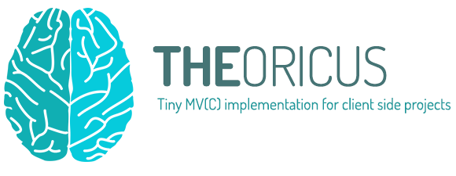

[](http://waffle.io/theoricus/theoricus)  

[](http://travis-ci.org/theoricus/theoricus) [](https://coveralls.io/r/theoricus/theoricus)

[](https://gemnasium.com/theoricus/theoricus) [](http://badge.fury.io/js/theoricus)

<!--
  [](https://saucelabs.com/u/theoricus)
-->

# About

Theoricus uses simple naming conventions (as you see in rails and many others),
with a powerful [build system](http://github.com/serpentem/polvo/polvo) behind
it. There's also a naviagation mechanism built to let your *free* to code your
**shit** instead of handling url's manually.

It's in a very alpha version, use at your own risk.

Have fun. :)

# Features
 * Routes system
 * Server-side rendering
 * Generators and destroyers for code scaffolding
 * I/O transitions for all Views
 * Convention over configuration *([+](http://en.wikipedia.org/wiki/Convention_over_configuration))*
 * Automagic naviagation mechanism
 * Powerful build system *(on top of [Polvo](http://github.com/serpentem/polvo/polvo)*)
 * Simplistic JSON-Rest interface for models

# Supported Languages

[Polvo](https://github.com/polvo/polvo) is the build system behind Theoricus,
and so you can use any language it supports - full list [here](https://github.com/polvo/polvo#plugins-supported-languages).

# Issues
Do not hesitate to open a feature request or a bug report.
> [https://github.com/theoricus/theoricus/issues](https://github.com/theoricus/theoricus/issues)

# Mailing List
A place to talk about it, ask anything, get in touch. Luckily you'll be answered
sooner than later.

> [https://groups.google.com/group/theoricus](https://groups.google.com/group/theoricus)

## Dev Mailing List

Got your hands into the source? We're here to help you.

> [https://groups.google.com/group/theoricus-dev](https://groups.google.com/group/theoricus-dev)


# Docs
  - [Installing](#installing)
  - [Help](#help)
    - [Scaffolding new app](#scaffolding)
    - [Starting up](#starting-up)

## More

<!--  - [Demo Application](https://github.com/theoricus/theoricus-demo-app) -->
  - [Contributing](https://github.com/theoricus/theoricus/blob/master/CONTRIBUTING.md)
  - [Showcase](https://github.com/theoricus/theoricus/wiki/showcase)
  - [Changelog](https://github.com/theoricus/theoricus/blob/master/History.md)
  - [License](https://github.com/theoricus/theoricus/blob/master/LICENSE)

<!--
  - [Compatibility](#compatibility)
-->

<a name="installing" />
# Installing

````bash
npm install -g theoricus
````

<a name="help" />
# Help

Theoricus help screen.

````bash
Usage:
  the [options] [params]

Options:
  -n, --new       Creates a new app                                                  
  -g, --generate  Generates a new model, view or controller                          
  -d, --destroy   Destroys a new model, view, or controller                          
  -s, --start     Starts app in dev mode at localhost                                
  -c, --compile   Compiles app in dev mode                                           
  -r, --release   Releases app for production                                        
  -p, --preview   Releases app for production at localhost                           
  -i, --index     Saving indexed version of app using `Snapshooter`                  
  -v, --version   Shows theoricus version                                            
  -h, --help      Shows this help screen                                             
  --url           Use with `-i` to inform a specif url to crawl                      
  --snapshooter   Use with `-i` to pass custom flags to `Snapshooter`                
  --rf            Use with -d [view|mvc] for deleting the whole view folder          
  --src           Use with -n for use a specific theoricus version as a git submodule
  --nogitsub      Use with --src for avoiding automatic git submodule setup          
  --base          Application base directory (in case you're inside it)              


Examples:

  • Creating new app
    the -n <app-name>
    the -n <app-name> --src <gh-user>/<gh-repo>#<repo-branch>

  • Generating models, views and controllers
    the -g model <model-name>
    the -g view <controller-name>/<view-name>
    the -g controller <controller-name>
    the -g mvc <controller-name>
       * Models and views names are singular, controllers are plural

  • Destroying models, views and controllers
    the -d model <model-name>
    the -d view <controller-name>/<view-name>
    the -d controller <controller-name>
    the -d mvc <controller-name>
    the -d mvc <controller-name> --rf
       * Models and views names are singular, controllers are plural
````

<a name="getting-started" />
## Scaffolding

To scaffold a new working project:

````bash
the -n myawesomeapp
````

It'll produce the following structure, which contains a default page section and
`404` Not Found error page:

````bash
myawesomeapp
├── README.md
├── package.json
├── polvo.yml
├── public
│   ├── app.css
│   ├── app.js
│   └── index.html
└── src
    ├── app
    │   ├── app.coffee
    │   ├── config
    │   │   ├── routes.coffee
    │   │   └── settings.coffee
    │   ├── controllers
    │   │   ├── app_controller.coffee
    │   │   ├── ovos.coffee
    │   │   └── pages.coffee
    │   ├── models
    │   │   ├── app_model.coffee
    │   │   ├── ovo.coffee
    │   │   └── page.coffee
    │   └── views
    │       ├── app_view.coffee
    │       ├── ovos
    │       │   └── index.coffee
    │       └── pages
    │           ├── container.coffee
    │           ├── index.coffee
    │           └── notfound.coffee
    ├── styles
    │   ├── ovos
    │   │   └── index.styl
    │   ├── pages
    │   │   ├── container.styl
    │   │   ├── index.styl
    │   │   └── notfound.styl
    │   └── shared
    │       └── _bootstrap.styl
    └── templates
        ├── ovos
        │   └── index.jade
        └── pages
            ├── container.jade
            ├── index.jade
            └── notfound.jade
````

<a name="starting-up" />
## Starting up

````bash
cd myawesomeapp
the -s
````

Visit the url [http://localhost:11235](http://localhost:11235) and you should
see a success status.

<!--
<a name="compatibility" />
# Compatibility

[](https://saucelabs.com/u/theoricus)
-->

# License

The MIT License (MIT)

Copyright (c) 2013 Anderson Arboleya

Permission is hereby granted, free of charge, to any person obtaining a copy of
this software and associated documentation files (the "Software"), to deal in
the Software without restriction, including without limitation the rights to
use, copy, modify, merge, publish, distribute, sublicense, and/or sell copies of
the Software, and to permit persons to whom the Software is furnished to do so,
subject to the following conditions:

The above copyright notice and this permission notice shall be included in all
copies or substantial portions of the Software.

THE SOFTWARE IS PROVIDED "AS IS", WITHOUT WARRANTY OF ANY KIND, EXPRESS OR
IMPLIED, INCLUDING BUT NOT LIMITED TO THE WARRANTIES OF MERCHANTABILITY, FITNESS
FOR A PARTICULAR PURPOSE AND NONINFRINGEMENT. IN NO EVENT SHALL THE AUTHORS OR
COPYRIGHT HOLDERS BE LIABLE FOR ANY CLAIM, DAMAGES OR OTHER LIABILITY, WHETHER
IN AN ACTION OF CONTRACT, TORT OR OTHERWISE, ARISING FROM, OUT OF OR IN
CONNECTION WITH THE SOFTWARE OR THE USE OR OTHER DEALINGS IN THE SOFTWARE.